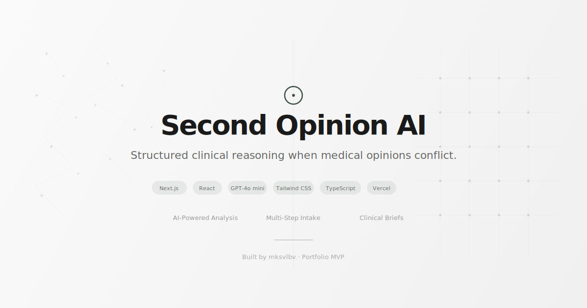

<p align="center">
  
</p>

<p align="center">
  <strong>AI-powered clinical reasoning framework for structuring complex medical histories.</strong><br><br>
  <a href="https://second-opinion-ai-dusky.vercel.app">Live Demo</a> · <a href="#what-it-does">What It Does</a> · <a href="#architecture">Architecture</a> · <a href="#getting-started">Getting Started</a> · <a href="https://second-opinion-ai-dusky.vercel.app/showcase.html">Product Showcase</a>
</p>

<p align="center">
  
  
  
  
  
</p>

---

Second Opinion AI turns patient-described symptoms into structured clinical briefs — identifying patterns, suggesting differential diagnoses, and generating targeted questions for physicians.

---

## What It Does

1. **Multi-step intake** — Guided onboarding collects symptoms, prior findings, and patient focus areas
2. **AI-powered analysis** — GPT-4o mini generates structured clinical reasoning in real-time
3. **Clinical brief output** — Summary, observations, differential interpretation, significance, and physician questions
4. **Print / copy** — Export-ready report for doctor conversations

## Architecture

```
src/
├── app/
│   ├── api/analyze/     → OpenAI Route Handler (GPT-4o mini)
│   ├── start/           → Multi-step intake wizard
│   ├── result/          → AI-generated clinical brief
│   ├── sample/          → Static sample analysis
│   └── [info pages]     → Methodology, Privacy, Terms, etc.
├── components/
│   ├── sections/        → Landing page sections (Hero, Problem, HowItWorks, etc.)
│   └── ui/              → Primitives (Button, Container, Section, Navbar, Footer)
└── globals.css          → Tailwind v4, grain texture, scroll animations
```

## Technical Stack

| Layer | Technology |
|-------|-----------|
| **Framework** | Next.js 16 (App Router, React 19) |
| **AI** | OpenAI GPT-4o mini via Route Handler |
| **Styling** | Tailwind CSS v4 |
| **Animation** | Custom Canvas (Entropy particle system), CSS transitions |
| **Typography** | Geist Sans + Geist Mono + Serif editorial |
| **Deployment** | Vercel |

## Key Design Decisions

- **Polymorphic Button** — Single component renders as `<button>` or `<Link>` based on `href` prop
- **Progressive reveal** — IntersectionObserver-driven scroll animations with `prefers-reduced-motion` support
- **Result caching** — AI responses cached in localStorage to avoid redundant API calls
- **Graceful fallback** — Static analysis shown with banner if AI API is unavailable
- **Accessibility** — `aria-hidden` on decorative elements, WCAG contrast ratios, min 11px font sizes

## Getting Started

### Prerequisites
- Node.js 18+
- OpenAI API key

### Installation
```bash
git clone https://github.com/mksvlbv/second-opinion-ai.git
cd second-opinion-ai
npm install
```

### Environment
Create `.env.local`:
```
OPENAI_API_KEY=your_openai_api_key_here
```

### Development
```bash
npm run dev
```

### Build
```bash
npm run build
```

## Deployment

[](https://vercel.com/new/clone?repository-url=https%3A%2F%2Fgithub.com%2Fmksvlbv%2Fsecond-opinion-ai&env=OPENAI_API_KEY&envDescription=OpenAI%20API%20key%20for%20clinical%20reasoning&project-name=second-opinion-ai)

Or manually:
1. Push to GitHub
2. Import project in [Vercel](https://vercel.com)
3. Add `OPENAI_API_KEY` as environment variable
4. Deploy

---

## License

MIT

---

*This is a conceptual demonstration of AI-first clinical reasoning UX. It is not intended for medical diagnosis or treatment. Always consult a qualified healthcare professional.*
